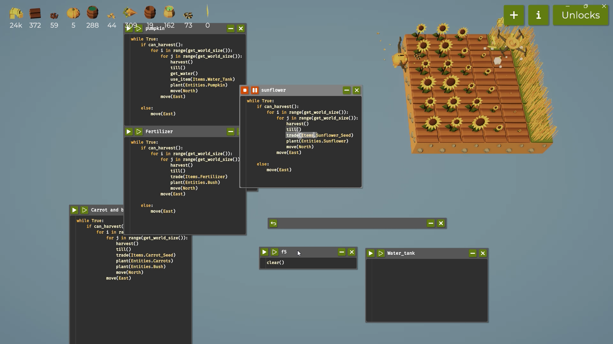

# SWE_CAP2_Game_Automation
<<<<<<< HEAD
# Programming the Farming Drone (Report)
## Introduction

It is a game where you control a drone to help with farming.The  drone can move up, down, left, right, plant seeds, harvest crops, spray water, trade items and more.
the objective of this game is to complete each framing task in the bestvway possible, using problem-solving skills to improve your farm's success and to improve your 
coding

# Table of Contents
- [Code Snippets and Explanation](#code-snippets-and-explanation)
- [Challenges and Learnings](#challenges-and-learnings)
- [References](#references)
# Code-Snippets-and-Explanation
Write and explain your code along with recordings.
## Step 1: Farming on 1 tile
**Code:**
```python
while True:
	if can_harvest():
		harvest()
```
**Explanation:**
The code runs an infinite number of times and harvest the grass with the if condition.
**Demo:**
Video Demo:

**Notes**
- Using the code above I was able to get enough hay to unlock the tile
- These features were unlocked too: variables and functions.

## Step 2: Farming on 3x3 tile
**Code:**
```python
while True:
	if can_harvest():
		for i in range(get_world_size()):
			for j in range(get_world_size()):
				harvest()
				plant(Entities.Bush)
				move(North)
			move(East)
```
**Explanation:**
The code runs an infinite number of times and harvest the grass with the if condition.
**Demo:**
Video Demo:

**Notes**
- Using the code above I was able to get enough hay to unlock the tile
- These features were unlocked too: variables and functions.

## Step 3: Farming Carrot tile 3x3 and 4x4
**Code:**
```python
while True:
	if can_harvest():
		for i in range(get_world_size()):
			for j in range(get_world_size()):
				harvest()
				till()
				trade(Items.Carrot_Seed)
				plant(Entities.Carrots)
				plant(Entities.Bush)
				move(North)
			move(East)
```
**Explanation:**
The code allows the player to trade for carrot seeds, then plant carrots and bushes. It sets up a sequence of actions where the player can acquire seeds and use them to grow crops.
**Demo:**
Video Demo:
3x3

4x4


**Notes**
- with the help of this code i am able to trade tree with carrot seed and plant carrot
- These features were unlocked too: Watering and Pumpkin.

## Step 4: Pumpkin tile 5x5
**Code:**
```python
while True:
	if can_harvest():
		for i in range(get_world_size()):
			for j in range(get_world_size()):
				harvest()
				till()
				get_water()
				use_item(Items.Water_Tank)
				trade(Items.Pumpkin_Seed)
				plant(Entities.Pumpkin)
				move(North)
			move(East)

	else:
		move(East)
```
**Explanation:**
The code retrieves water, uses a water tank, trades for pumpkin seeds, and then plants pumpkins. It establishes a sequence of actions for the player to acquire water and seeds to grow pumpkins.

**Demo:**
Video Demo:


**Notes**
- with the help of this code i am able to trade carrot  with pumpkin seed and plant pumpkin

- These features were unlocked too: Watering and Pumpkin. Fertilizer , mazes and utilities

## Step 5: fertilizer tile 5x5
**Code:**
```python
while True:
	if can_harvest():
		for i in range(get_world_size()):
			for j in range(get_world_size()):
				harvest()
				till()
				trade(Items.Fertilizer)
				plant(Entities.Bush)
				move(North)
			move(East)
			
	else:
		move(East)
```
**Explanation:**
The code harvests crops, tills the soil, trades for fertilizer, and then plants bushes. It runs indefinitely, allowing for continuous harvesting and planting of bushes to sustain the farm.

**Demo:**
Video Demo:


**Notes**
- with the help of this code i am able to trade fertilizer with 10 pumpkin 

- These features were too instantly

 grow the plant under the drone by 2s

## Step 5: sunflower tile 6x6
**Code:**
```python
while True:
	if can_harvest():
		for i in range(get_world_size()):
			for j in range(get_world_size()):
				harvest()
				till()
				trade(Items.Sunflower_Seed)
				plant(Entities.Sunflower)
				move(North)
			move(East)
			
	else:
		move(East)
```
**Explanation:**
The code tills the soil, trades for sunflower seeds, and then plants sunflowers. It runs in an infinite loop, allowing for continuous preparation of the land and planting of sunflowers.
**Demo:**
Video Demo:



**Notes**
- with the help of this code i am able to trade power with sunflower and sunflower is traded with one carrot.

- These features were too increase the power gained from sunflower


# Challenges and Learnings
## Challenges
The code is designed to continuously harvest crops, till the soil, water the plants, and plant pumpkins in a grid-like pattern. However, a challenge arises when the drone starts harvesting; it may suddenly stop due to various reasons, such as running out of resources or encountering obstacles.

To address this issue, I've implemented an else statement that instructs the drone to move east when it cannot harvest. This ensures that the drone keeps moving and searching for areas where it can harvest, rather than getting stuck or stopping entirely.
## Learnings
Iteration: The drone iterates through each cell of the world grid.
Harvest: If the drone can harvest, it harvests crops.
Till: If the drone can till, it tills the soil.
Water: If the drone needs to water, it uses its water tank.
Plant: If the drone has appropriate items, it plants crops.
Movement: The drone moves to the next cell in a specific direction (e.g., East).
## References
List any resources, articles, or libraries you used or referenced while working on this project.
1. [https://youtu.be/F5bpI_od1h0?si=1BNpE1wVb_X-q_W5](URL)
2. [https://youtu.be/3Gk84cwjGzY?si=gYrP0mZy7u4V8D0e](URL)

## Google Drive Video
[Google Drive link](https://drive.google.com/drive/folders/1xTLuFSW3yjlDNZm43x0movUdcK_yerKb?usp=drive_link)